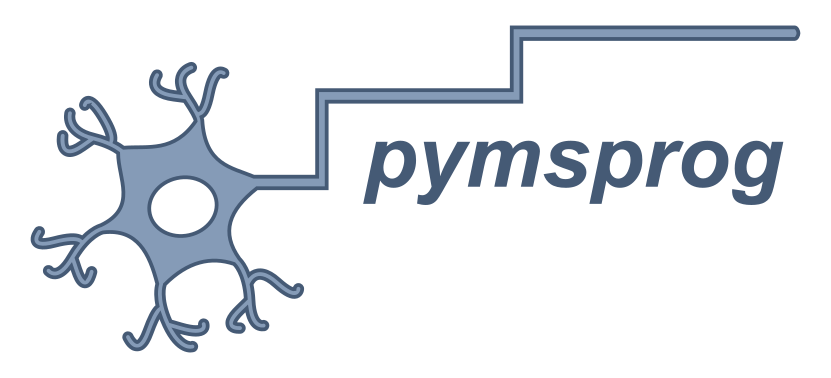

<br/>

> [!WARNING]
> **🚧 This repository is under active development. 🚧 <br>
> Please make sure you are using the latest version of the library 
> (as per [PyPI](https://pypi.org/project/pymsprog/)) – or at least v1.0.0, 
> which is functionally stable, though some minor aspects may still change ahead of a full 
> stable release.** 

[//]: # (<br>)

[//]: # ()
[//]: # (> 📣 **What’s new in latest version**  )
[//]: # (> ...)

# pymsprog: reproducible assessment of disability course in MS

<p align="center">
  
</p>


[📖 **Documentation and TUTORIALS**](https://pymsprog.readthedocs.io)

`pymsprog` is a Python package providing tools for exhaustive and reproducible
analysis of disability course in multiple sclerosis (MS) from longitudinal data. 
An [R version](https://github.com/noemimontobbio/msprog) of the library is available as well.

Its core function, `MSprog()`, detects and characterises the evolution
of an outcome measure (Expanded Disability Status Scale, EDSS; Nine-Hole Peg Test, NHPT;
Timed 25-Foot Walk, T25FW; Symbol Digit Modalities Test, SDMT; or any custom outcome
measure) for one or more subjects, based on repeated assessments through
time and on the dates of acute episodes (if any).

The package also provides a small toy dataset for testing and demonstration purposes.
The dataset contains artificially generated Extended Disability Status Scale (EDSS) and 
Symbol Digit Modalities Test (SDMT) longitudinal scores, visit dates, and relapse onset dates
in a small cohort of example patients.

**If you use this package in your work, please cite as follows:**<br />
Montobbio N, Carmisciano L, Signori A, et al. 
*Creating an automated tool for a consistent and repeatable evaluation of disability progression 
in clinical studies for multiple sclerosis.* 
Mult Scler. 2024;30(9):1185-1192. doi:10.1177/13524585241243157

For any questions, requests for new features, or bug reporting, please
contact: **noemi.montobbio@unige.it**. Any feedback is highly
appreciated!

## Installation

You can install the latest release of `pymsprog`  with:
```bash
pip install pymsprog
```
Alternatively, the development version can be downloaded from 
[GitHub](https://github.com/noemimontobbio/pymsprog).


## Quickstart

The `MSprog()` function detects disability events sequentially 
by scanning the outcome values in chronological order. 

Let's start by importing toy data and applying `MSprog()` to analyse EDSS course with 
the default settings.

```python
from pymsprog import MSprog, load_toy_data

# Load toy data
toydata_visits, toydata_relapses = load_toy_data()

toydata_visits.head()
'''
   id        date  visit_day  EDSS  SDMT
0   1  2021-09-23          0   5.5    54
1   1  2021-11-03         41   5.5    54
2   1  2022-01-19        118   5.5    57
3   1  2022-04-27        216   5.5    55
4   1  2022-07-12        292   6.0    57
'''

toydata_relapses.head()
'''
   id        date  visit_day
0   2  2021-06-12        198
1   2  2022-10-25        698
2   3  2022-12-01        409
3   6  2022-12-18        426
4   7  2021-09-11        185
'''

# Detect events
summary, results = MSprog(toydata_visits,                          # insert data on visits
                 relapse=toydata_relapses,                         # insert data on relapses
                 subj_col='id', value_col='EDSS', date_col='date', # specify column names 
                 outcome='edss')                                   # specify outcome type
'''
---
Outcome: edss
Confirmation over: 84 (-7, +730.5) days
Baseline: fixed
Relapse influence (baseline): [30, 0] days
Relapse influence (event): [0, 0] days
Relapse influence (confirmation): [30, 0] days
Events detected: firstCDW
---
Total subjects: 7
---
Subjects with CDW: 4 (PIRA: 3; RAW: 1)
'''
```

Several qualitative and quantitative options for event detection are given as arguments that 
can be set by the user and reported as a complement to the results to ensure reproducibility. 
For example, instead of only detecting the first confirmed disability worsening (CDW) for 
each subject, we can detect *all* disability events sequentially by moving the baseline after
each event (`event='multiple', baseline='roving'`)`:

```python
summary, results = MSprog(toydata_visits,                          # insert data on visits
                 relapse=toydata_relapses,                         # insert data on relapses
                 subj_col='id', value_col='EDSS', date_col='date', # specify column names 
                 outcome='edss',                                   # specify outcome type
                 event='multiple', baseline='roving')              # modify default settings
'''
---
Outcome: edss
Confirmation over: 84 (-7, +730.5) days
Baseline: roving
Relapse influence (baseline): [30, 0] days
Relapse influence (event): [0, 0] days
Relapse influence (confirmation): [30, 0] days
Events detected: multiple
---
Total subjects: 7
---
Subjects with CDW: 5 (PIRA: 5; RAW: 1)
Subjects with CDI: 2
---
CDW events: 6 (PIRA: 5; RAW: 1)
CDI events: 2
'''
```

The function prints out a concise report of the results, as well as 
**the specific set of options used to obtain them**. 
Complete results are stored in the following two `pandas.DataFrame` objects generated by the function call.
    
1. Extended info on each event for all subjects:
```python
print(results)
'''
   id  nevent event_type CDW_type  total_fu  time2event  bl2event  sust_days  sust_last
0   1       1        CDW     PIRA     534.0       292.0     292.0      242.0        1.0
1   2       1        CDW      RAW     730.0       198.0     198.0       84.0        0.0
2   2       2        CDW     PIRA     730.0       539.0     257.0      191.0        1.0
3   3       0                         491.0       491.0       NaN        0.0        0.0
4   4       1        CDI              586.0        77.0      77.0       98.0        0.0
5   4       2        CDW     PIRA     586.0       304.0     129.0      282.0        1.0
6   5       1        CDW     PIRA     637.0       140.0     140.0      497.0        1.0
7   6       1        CDI              491.0       120.0     120.0      232.0        0.0
8   7       1        CDW     PIRA     779.0       372.0     372.0      407.0        1.0
'''
```

where: `nevent` is the cumulative event count for each subject; `event_type` and `CDW_type` characterise the event; 
`total_fu` is the total follow-up period of the subject in days;
`time2event` is the number of days from the beginning of the follow-up to the event 
(coincides with length of follow-up if no event is detected); 
`bl2event` is the number of days from the current baseline to the event; 
`sust_days` is the number of days for which the event was sustained; 
`sust_last` reports whether the event was sustained until the last visit.

2. A summary table providing the event count for each subject and event type:
```python
print(summary)
'''
  event_sequence  CDI  CDW  RAW  PIRA
1           PIRA    0    1    0     1
2      RAW, PIRA    0    2    1     1
3                   0    0    0     0
4      CDI, PIRA    1    1    0     1
5           PIRA    0    1    0     1
6            CDI    1    0    0     0
7           PIRA    0    1    0     1
'''
```

where: `event_sequence` specifies the order of the events; 
the other columns count the events of each type.

